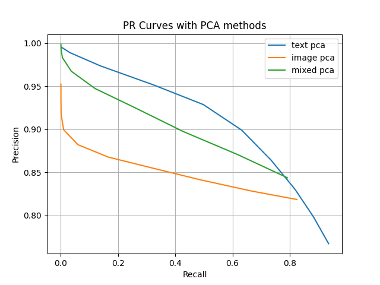

# Practice for Content Based Image Retrieval 
This project is a practice for 'pattern recognition' class, analyzing CBIR problem.
The dataset used in here is shopee-product-matching from [Shopee - Price Match Guarantee](https://www.kaggle.com/c/shopee-product-matching/overview).

First of all, thanks for some developers to share clear explanation and their codes. This work is mainly designed on the bases they already made, and I put some my own changes or experiments to study. About where I've referred these information, I'll write at the bottom of this document.

As a beginner, I hope to be good at Github, as well as studying throughout this work.

## Prerequisites
This project is desined and tested on virtual-environment, Anaconda, on Windows. I recommend you to setup in virtual-environment as well to protect your own development environment. 
* CUDA 10.1
* cuDNN 7.6
* Python 3.8.8
* Pytorch 1.8.1
* Shopee-product-matching dataset (Dataset is available at [Shopee-product-matching](https://www.kaggle.com/c/shopee-product-matching/data))

Plus, since I am still not skillful with dealing memory, it may performs very inefficiently and consuming resources. About this problem, I'll edit some parts to solve. 

## Installation
First of all, create a new virtual-environment, for example, `cbir`. In Anaconda prompt try (I only wrote command-line):

    (base) > conda create -n cbir -f requirements.yaml
    (base) > conda activate cbir

If you want to run this program with `jupyter notebook`, move to `~~~/Context_Based_Image_Retrieval` and try:

    (cbir) > jupyter notebook

The required directory sturcutre is:

```bash
─── Context_Based_Image_Retrieval/
    ├── shopee-product-matching/
    |   ├── test_images/
    |   ├── train_images/
    |   ├── train.csv
    |   ├── test.csv
    |   └── ...
    ├── sift_materials_svm/
    ├── pca_materials/
    |    ├── text_materials/
    |    ├── image_materials/
    |    └── mixed_materials/
    ├── cnn_feature_materials/
    ├── img/
    ├── pca_image.py
    ├── pca_imageMake.py
    ├── pca_title.py
    ├── pca_titleMake.py
    ├── pca_mixture.py
    ├── sift_image.py
    ├── CNN_retrieval.py
    ├── requirements.yaml
    └── README.md
```

## Demo

In here, I'll use these methods:
* Principal component analysis (PCA)
  * text info.
  * image info.
  * mixed
* SIFT feature
  * image info.
* Deep-Learning based
  * text info.
  * image info.
  * mixed

## 1. Principal Component Analysis (PCA)

Every method you should run `pca_titleMake.py`, `pca_imageMake.py` first, respectively making `##_trained_text_feature.csv` and `##_trained_image_feature.csv`. And the `###` of file name means, the number of samples when the file was made.
### text info.

Can start by command below. *(should check your current path)*

    (cbir) > python pca_titleMake.py

It will ask you how many samples do you want to use for training, input numbers.
After this, `###_trained_text_feature.csv` will be saved at `pca_feature_materials/` directory, to save time in after running. This file is a calculated features matrix, consuming lots of resources and times.

And we can check this method's score. (score training model)

    (cbir) > python pca_title.py

It will ask you to input the number how many samples you used to make feature data. To score trained model, `F1 score`, `Precision`, `Recall` will be used. I used 10000 data as training data (0~9999), the result of training as below:

||F1|Precision|Recall|
|---|---|---|---|
|TEXT info|0.551|0.750|0.538|


### image info.
In `pca_image.py`, you also can change the number of samples, N_SAMPLE. As similar with `pca_title.py`, you can start by command below. *(should check your current path)*

    (cbir) > python pca_imageMake.py

Same with above, you have to input how many samples you want to use.

    (cbir) > python pca_image.py

The result below is produced from 5000 training samples (0~5999):

||F1|Precision|Recall|
|---|---|---|---|
|IMAGE info|0.768|0.847|0.766|

### mixed info.
For mixed features, I used 6000 data for training. To run this, you should already have both for `###_trained_text_feature.csv` and `###_trained_image_feature.csv`.

    (cbir) > python pca_mixture.py

||F1|Precision|Recall|
|---|---|---|---|
|TEXT info|0.812|0.749|0.964|
|IMAGE info|0.842|0.811|0.876|
|mixed info|0.852|0.826|0.856|


## 2. SIFT feature
Because SIFT features are describing some points in the image, I didn't prepare about text information here. For running this:

    (cbir) > python sift_image.py

And this has some figures showing the result of feature matching. 

<p align="center"> 
 
</p>
<p align="center"> 
 
</p>

These figures show the feature matching result as an example, between different label groups and same label groups.

It also has a clustering process and uses them to make new feature to train SVM model. Every single SIFT feature point will be divided by clusters, and the SIFT feature points in one image will be counted. 
<p align="center"> 
 
</p>


After you did, svm model files will be saved at `sift_materials_svm/`. For example, `svm_model.m` and `##svm_centers_.npy` files will be saved at `sift_materials_svm/`. About the process of this code, please refer next section.

<p align="center"> 
 
</p>

Left side is input (query) image, and right one is output. Indeed, this program will predict a `label_group` with given images, but just to make more easier to figure out what the label is, it shows one image from **predicted label**.

And the score is,

||F1|Precision|Recall|
|---|---|---|---|
|IMAGE info|0.123|0.200|0.089|

## 3. Deep-Learning Based

Deep-Learning based method mainly refers [this](https://www.kaggle.com/finlay/unsupervised-image-text-baseline-in-20min). 

    (cbir) > python CNN_retrieval.py

And the score with 6000 samples is below, 
||F1|Precision|Recall|
|---|---|---|---|
|TEXT info|0.804|0.991|0.741|
|IMAGE info|0.876|0.990|0.835|
|mixed|0.883|0.987|0.847|

# Analysis

There will be brief analysis about this project and experiment. One is for myself to have more impression during this work and also for others to easily remind some concepts. 

## Dataset
Given dataset, `shopee-product-matching` has more than 30,000+ training samples and images respectively. Every single item has `label_group`, more than 10,000+. Briefly shows,

<p align="center"> 
 
</p>

At the very first, it will search for other items whose label_group are same with given item. And create one column containing these lists. This is what `target` column means. So you can make sense which one is in same label_group, as well as given item. 

## 1. Principal Component Analysis (PCA)

In here, text (item title) and image information will be used to extracting feature from given dataset. All of codes are written in `anaconda`. 

### TEXT info


For extracting feature from text data, I used `TF-IDF` features. `TF-IDF` is short-term of `Term Frequency - Inverse Document Frequency`. It mainly focuses on how frequent the word appears, and also considers whether the word is also appeared in other sample. If so, the importance of the word will be decreased as well. 

Because every word in the whole dataset is not quite repeatedly, dimension of original feature is huge, probably causing the curse of dimensionality. To tackle with this, I used PCA to decrease original `n`-dim feature into `k`-dim feature. (n > k)

To satisfy performance as well, there is searching `k` value which can explain more than 95% of original features' variance. In graph below, since it seems like still has great dimension, you can also consider lower `k`, or lower percentage.

<p align="center"> 
 
</p>

As figure shows, training samples originally have 10000+ features, which is huge dimension. By analyzing principle components, the eigenvectors of original features will be re-arranged in order of importance. In the graph above, we can figure out how many features we have to use to explain the variance of original features data. Graph shows if we use 5000+ principal components, can explain 95% variance of original data. Since it is still a big number, we can consider using lower dimension.

### IMAGE info

I regarded every single pixel as one feature, 512x512 size image has 1x262144 features vector. And after by PCA we can decrease this huge dimension into small one. 

<p align="center"> 
 
</p>

With similar process, it seems more than 1000+ principal components will have good performance. And the whole score with PCA method is below :

||F1|Precision|Recall|
|---|---|---|---|
|TEXT info|0.551|0.750|0.538|
|IMAGE info|0.768|0.847|0.766|

Considering PR-curves of PCA model, it seems like those graphs with `image-pca` and `mixed-pca` is not very ideal. The graphs are made with changes of threshold value from 0 to 1. 
<p align="center"> 
 
</p>


## 2. SIFT feature

To classify items with SIFT features, it is basic step to figure out how can we define the similarity of two SIFT features groups. At the first think, I tried clustering all of SIFT features from whole training image set. After clustering original SIFT features into some clusters, e.g. 30, the SIFT features in every single image are re-arranged into those 30 clusters. So we can check how those SIFT features in single image are distributed. 

<p align="center"> 
 
</p>

After repeating the process above, I trained those features by SVM. 
The reason why I mixed some other method is that I thought it may not be proper to calculate distance (for similarity) with original SIFT features descriptors. But different with my expectation, the performance is not good enough.

<p align="center"> 
 
</p>

||F1|Precision|Recall|
|---|---|---|---|
|IMAGE info|0.123|0.200|0.089|

I think the reason is because SIFT features are highly sensitive to letter in image, which is not important part of item image. Furthermore, to make process more easily, I limited the number of SIFT features when the features are extracted from image. And the number of features every image has isn't predictable. For instance, I set limit to obtain just 100 SIFT features from image. Then probably I couldn't get enough number of features for some cases. 

After this project, I will continue to engage in searching other methods to define image's similarity while using SIFT feature.

## 3. Deep-Learning Based 

Convolution Neural Network (CNN) was used as a method for Deep-Learning Based model, especially ResNet-18, which is constructed with 18 layers deep. Different with other methods, CNN can automatically choose and extract features from given images.

<p align="center"> 
 
</p>

Further analysis is probably necessary for me, and the result with whole samples is below :

||F1|Precision|Recall|
|---|---|---|---|
|TEXT info|0.516|0.963|0.387|
|IMAGE info|0.543|0.982|0.409|
|mixed|0.855|0.952|0.836|


# REFERENCE
```
https://www.kaggle.com/mirzarahim/introduction-to-pca-image-compression-example
https://github.com/vivekrmk/Image-Compression-Principal-Component-Analysis-Pytorch
https://github.com/Erikfather/PCA-python
https://wikidocs.net/24603
https://www.kaggle.com/finlay/unsupervised-image-text-baseline-in-20min
```
